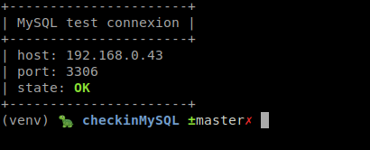
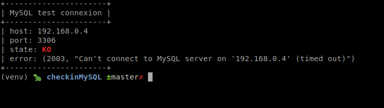

# checkMySQL
> Check MySQL connexion

Python3

## usage

OS X, Linux or Windows:

```sh
pip install -r requirements.txt
```

Use the client:

```sh
python cli.py check --host ip/domain --user root --password root_password --db database_name
```

Python Class:

```python
from checkmysql import MySQLConn

con = MySQLConn.create('192.168.0.1', 'root', 'root_password', 'database_name', 3306)
res = con.test()
print(res)
```





## Requirements

* Click==7.0
* PyMySQL==0.9.3

## Meta

Lucian – [@odgon](https://twitter.com/odgon)

Distributed under the MIT license. See ``LICENSE`` for more information.

[checkMySQL](https://github.com/odgon/checkMySQL)